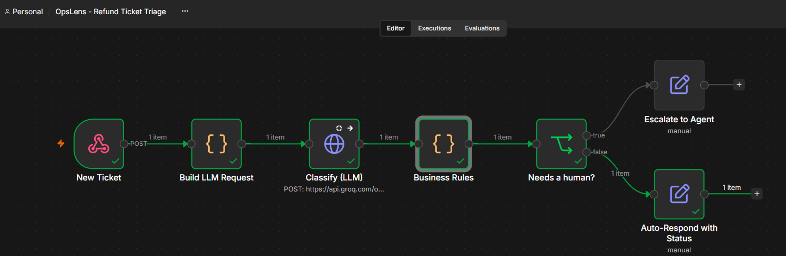
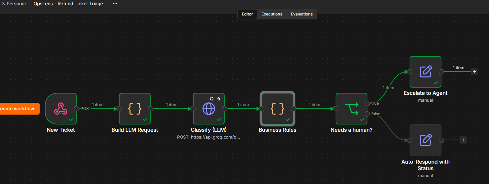

# OpsLens

**Which product friction point deserves engineering time?**

34,307 support tickets → SQL → Python → LLM → n8n automation → KPIs.



---

## The finding

> **`amount_incorrect` returned zero across 200 classified tickets.
> The refund system calculates correctly. It does not communicate.**

94% of affected refund tickets were customers contacting support **only to get information the product should have shown them.**

---

## 1. Problem

| | |
|---|---|
| Context | Support volume growing, headcount flat |
| Ask | A product fix, not more agents |
| Data | 34,307 tickets · 6 areas · Mar–Aug 2026 |
| Question | Which friction point should Product fund first? |

## 2. Primary KPI — repeat-contact rate

Same user, same product area, follow-up within 7 days.

**Why this one:** it is simultaneously a customer-pain signal and an operational-cost signal. Resolution time measures effort. CSAT measures feeling. Repeat contact measures **failure**.

| Guardrail | Catches |
|---|---|
| Resolution rate | "Fixing" repeats by leaving tickets open |
| Median resolution time | Agents spending far longer per ticket |

## 3. SQL — finding the problem

| Area | Tickets | % volume | Repeat rate | Verdict |
|---|---|---|---|---|
| Payments | 8,980 | 26.2% | 17.2% | Biggest, **healthy** |
| Delivery | 5,796 | 16.9% | 18.6% | Slow, **at baseline** |
| **Refunds** | **5,508** | **16.1%** | **31.0%** | **1.7× baseline** |
| Orders | 6,537 | 19.1% | 14.3% | Fine |
| Account | 4,549 | 13.3% | 14.1% | Fine |
| Subscription | 2,937 | 8.6% | 13.5% | Fine |

**Baseline: 18.4%. Excess: ~700 contacts / 6 months.**

### What was ruled out, and why

| Area | Why not |
|---|---|
| Payments | Largest by volume, but *below* baseline. Volume = usage, not failure. |
| Delivery | Slower than Refunds (22.8h), but repeat rate at baseline — customers contact once and get resolved. **Vendor problem, not product problem.** |

## 4. Narrowing it

| Issue type | Tickets | Lift | Excess |
|---|---|---|---|
| refund_status_unclear | 1,871 | **1.94×** | 323 |
| refund_not_received | 1,982 | **1.87×** | 318 |
| partial_refund | 875 | 1.21× | 34 |
| refund_rejected | 780 | 1.15× | 22 |

**92% of the excess sits in two issue types.** 

## 5. Who — a negative result

| Segment | Refunds | Elsewhere | Gap |
|---|---|---|---|
| Enterprise | 28.1% | 11.9% | +16.2pp |
| Consumer | 30.1% | 14.4% | +15.7pp |
| VIP | 26.0% | 11.1% | +14.9pp |
| SMB | 34.4% | 21.0% | +13.4pp |

**No segment is specially affected.** SMB has the *highest raw* rate but the *smallest gap* — it runs hot everywhere. Ranking on the raw rate would have produced an SMB-specific recommendation the evidence does not support.

No segment effect → the problem is **structural**, in the workflow.

## 6. When — difference-in-differences

| Month | Refunds | Control (all other areas) |
|---|---|---|
| Mar | 25.4% | 13.5% |
| Apr | 27.9% | 16.2% |
| May | 29.3% | 16.5% |
| **Jun** | **32.3%** | 16.6% |
| Jul | 33.3% | 16.5% |
| Aug | **35.5%** | 16.2% |

**+7.6pp DiD · z = 5.6 · control flat.**

Volume grew 26% over this period. The control group absorbs that. What remains is specific to refunds.

## 7. Metric validation

Rebuilt `repeat_contact` from raw timestamps with a `LAG()` window function.

| | |
|---|---|
| Agreement with shipped column | **98.9%** |
| Direction of error | Over-counts (coincidental same-area repeats) |
| Implication | Estimate is **conservative** |

## 8. AI — only after the cheap method

**Word-frequency baseline ran first.** Result: `pending`, `status`, `nobody`, `anywhere`. Confirmed the vocabulary, produced a word cloud — not a hypothesis. The LLM was used only for structure.

200 tickets, stratified 50 per issue-type × period cell. Closed taxonomy, `temperature=0`, forced JSON.

| Theme | Share |
|---|---|
| no_status_visibility | 42.5% |
| money_not_received | 42.0% |
| timeline_not_met | 13.0% |
| no_response_from_support | 2.5% |
| **amount_incorrect** | **0%** |

**Self-service gap: 94%.**

Severity splits along a real line — `money_not_received` 88% high ("I'm out of pocket"), `no_status_visibility` 82% medium ("I can't tell what's happening"). Two states, two information needs.

### Evaluation

| Metric | Result |
|---|---|
| Pipeline success rate | 100% (200/200 valid JSON) |
| Theme accuracy | 86.7% (n=30, hand-labelled) |
| Self-service-gap accuracy | 90.0% (n=30) |

**Success rate ≠ accuracy.** 100% means every call parsed. It says nothing about correctness.

**All four errors were one phrasing** — *"nobody can tell me when I get my money back"* — genuinely both a visibility and a money complaint. Taxonomy ambiguity, not model failure. **None touched `self_service_gap`**, the field the recommendation depends on.

### Confidence layers

| Layer | Claim | Confidence |
|---|---|---|
| Observed (SQL) | 1.7× rate, 2 issue types, +7.6pp vs control | High — reproducible |
| AI-derived | 94% self-service gap | Medium — sampled, ~85–90% accurate |
| Hypothesis | Missing status surface; mid-June change | Low — needs deploy-log check |
| **Rejected** | "Verification backlog" | **None — model invention** |

## 9. Recommendation

**Ship a refund status tracker:**

| # | Element | Serves |
|---|---|---|
| 1 | Current state (Requested → Approved → Sent → Settled) | Medium-severity group |
| 2 | **Expected arrival date** | High-severity group |
| 3 | Date funds left our system | High-severity group |


**Why not just a better agent macro?** A macro makes 1,400 annual contacts *faster*. A status page removes the *reason* for them.

## 10. n8n automation

`New ticket → webhook → LLM classification → deterministic rule → route → log`

| Layer | Owns | Why |
|---|---|---|
| **LLM** | Reading text → theme, self_service_gap | Language is the only part rules can't do |
| **Rule** | Escalate vs auto-respond | Must be auditable and identical every time |

### Escalation rules, in priority order

| # | Condition | Action |
|---|---|---|
| 1 | AI unavailable | **Escalate** — fail-safe, never guess |
| 2 | P1 or high-risk issue type | **Escalate** — rule, not model |
| 3 | `amount_incorrect` | **Escalate** — money may be wrong |
| 4 | `self_service_gap = true` | Auto-respond |
| 5 | Anything else | **Escalate** — default to human |

**An LLM never owns the escalation decision.**

### Information request → auto-responded


`refund_status_unclear`, P3 → `self_service_gap: true` → auto-responded. No agent touched it.

### Payment failure → escalated



`payment_failed`, P1 → escalated by **rule**, before the model's opinion mattered.

## 11. Measurement

| | |
|---|---|
| **Hypothesis** | Exposing state + expected arrival date reduces repeat contacts, because 94% are information-seeking |
| **Control** | Existing refund flow |
| **Treatment** | Status tracker with expected arrival date |
| **Primary KPI** | Refund repeat-contact rate: 31.0% → target <22% |
| **Guardrail 1** | Resolution rate must not fall below 93.8% |
| **Guardrail 2** | Median resolution must not exceed 25.7h |
| **Unit** | User, randomised on first refund request |

**Estimated impact:** ~1,400 excess contacts/year × 12 min × £25/hr ≈ **£7,000/year** in avoidable handling — before deflection of non-excess status enquiries.

*Ticket count is measured. Cost per ticket is an assumption.*

## 12. Architecture

```
tickets.csv
    |
SQLite - clean_tickets view          cleaning defined once
    |
SQL - 7 queries                      which area, which issue, who, when
    |
Pandas                               difference-in-differences, z-test, sampling
    |
LLM - 200 tickets                    -> structured JSON
    |
Eval - 30 hand-labelled              -> accuracy
    |
Streamlit dashboard  +  n8n workflow
```

## 13. Stack

`SQL (SQLite)` `Python` `pandas` `Streamlit` `Plotly` `gpt-oss-120b via Groq` `n8n` `Jupyter`


---

## Run it

```bash
python -m venv .venv && .venv/Scripts/activate
pip install -r requirements.txt

python generate_data.py
python -c "import pandas as pd, sqlite3; pd.read_csv('data/tickets.csv').to_sql('tickets', sqlite3.connect('data/opslens.db'), if_exists='replace', index=False)"

cp .env.example .env          # add LLM_API_KEY
streamlit run dashboard/app.py
```

Dashboard runs without an API key — the AI page degrades rather than crashing.
